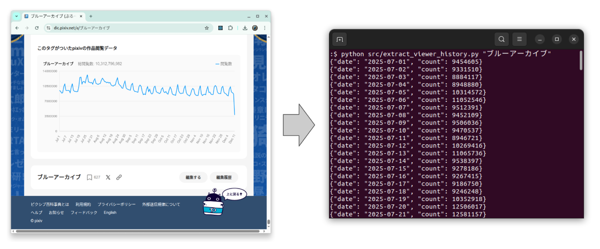

# [Pixiv Encyclopedia Viewer History Extractor](https://github.com/europanite/pixiv_encyclopedia_viewer_count_history_extractor "Pixiv Encyclopedia Viewer History Extractor")

[](https://github.com/europanite/pixiv_encyclopedia_viewer_count_history_extractor/actions/workflows/codeql.yml)
[](https://github.com/europanite/pixiv_encyclopedia_viewer_count_history_extractor/actions/workflows/lint.yml)
[](https://github.com/europanite/pixiv_encyclopedia_viewer_count_history_extractor/actions/workflows/pytest.yml)



Pixiv百科事典（Pixiv Encyclopedia / pixiv百科事典）の記事から、**日ごとの閲覧数（view history）を抽出するためのスクリプト**です。

## English README

An English version of this README is available in [`README.md`](README.md).

---

## 概要

Pixiv大百科の閲覧履歴は、1週間スパンの周期性（平日／休日）がはっきり表れる実データです。

また、作品のイベントやSNSでのバズによる突発的なスパイクも含まれるため、次のような時系列分析の教材として利用できます。
- 可視化・平滑化の例
- 季節性分解の例
- 予測モデル（ARIMA, Prophet など）のサンプルデータ

> ⚠️ **非公式ツールです**  
> このツールは Pixiv 公式のものではありません。  
> 利用にあたっては、Pixiv の利用規約・robots.txt を必ず守ってください。

---

## 機能

- **記事タイトル**（例: `"ブルーアーカイブ"`）を指定して直接 Pixiv百科事典から取得
- すでに保存した **ローカル HTML ファイル** を解析することも可能
- 標準出力に **JSON Lines** 形式で出力  
  （1 行につき `{"date": "...", "count": ...}` を 1 レコード）
- `--csv` オプションで **CSV ファイル** にもエクスポート

---

## 動作環境

- Python 3.9 以上
- 使用ライブラリ:
  - `requests`
  - `beautifulsoup4`

---

## 使い方

### 0. Create virtual environment

```bash
python3 -m venv env
source env/bin/activate
pip install -r requirements.txt
```

### 1. 記事タイトルから取得

```bash
python src/extract_viewer_history.py "ブルーアーカイブ"
```

このコマンドは:

- `https://dic.pixiv.net/a/ブルーアーカイブ` にアクセス
- ページ内 JSON を解析
- 標準出力に 1 行 1 レコードの JSON を出力します:

```json
{"date": "2025-07-01", "count": 9454605}
{"date": "2025-07-02", "count": 9331510}
{"date": "2025-07-03", "count": 8884117}
...
```

ファイルに保存したい場合:

```bash
python src/extract_viewer_history.py "ブルーアーカイブ" > ブルーアーカイブ.jsonl
```

### 2. CSV で保存する

`--csv` オプションで CSV を同時に出力できます（標準出力の JSON はそのまま）。

```bash
python src/extract_viewer_history.py "ブルーアーカイブ" --csv ブルーアーカイブ.csv
```

出力される CSV の例:

```csv
date,count
2025-07-01,9454605
2025-07-02,9331510
2025-07-03,8884117
...
```

### 3. ローカル HTML ファイルを解析する

事前にブラウザから HTML を保存してある場合:

```bash
python src/extract_viewer_history.py ブルーアーカイブ.html
python src/extract_viewer_history.py ブルーアーカイブ.html --csv ブルーアーカイブ.csv
```

`ブルーアーカイブ.html` というファイルが存在すれば、  
タイトルではなく **ローカルファイル** として扱われます。

### 4. テスト

```bash
pip install -r requirements.test.txt
pytest
```

### 5. 環境を閉じる

```bash
deactivate
```

---

## 制限事項

- Pixiv百科事典の内部 JSON 構造（`__NEXT_DATA__` / `swrFallback` / `/get_graph_data` など）に依存しています。  
  フロントエンド構造が変更されると動かなくなる可能性があります。
- このスクリプトにはアクセス回数制限などは入れていません。  
  - 連続アクセスしすぎない  
  - 個人利用・検証用途など、常識的な範囲での利用を推奨します。
- あくまで個人的な解析・研究用途を想定したシンプルなツールです。

---

## ライセンス

- Apache License 2.0
