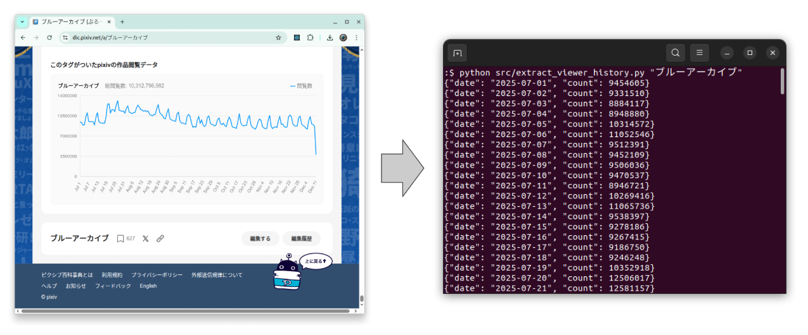

# [Pixiv Encyclopedia Viewer History Extractor](https://github.com/europanite/pixiv_encyclopedia_viewer_count_history_extractor "Pixiv Encyclopedia Viewer History Extractor")

[](https://www.python.org/)


[](https://github.com/europanite/pixiv_encyclopedia_viewer_count_history_extractor/actions/workflows/codeql.yml)
[](https://github.com/europanite/pixiv_encyclopedia_viewer_count_history_extractor/actions/workflows/lint.yml)
[](https://github.com/europanite/pixiv_encyclopedia_viewer_count_history_extractor/actions/workflows/pytest.yml)

<p align="right">
  <a href="https://europanite.github.io/pixiv_encyclopedia_viewer_count_history_extractor/">🇺🇸 English</a> |
  <a href="https://europanite.github.io/pixiv_encyclopedia_viewer_count_history_extractor/hi/">🇮🇳 हिंदी</a> |
  <a href="https://europanite.github.io/pixiv_encyclopedia_viewer_count_history_extractor/ja/">🇯🇵 日本語</a> |
  <a href="https://europanite.github.io/pixiv_encyclopedia_viewer_count_history_extractor/zh-CN/">🇨🇳 简体中文</a> |
  <a href="https://europanite.github.io/pixiv_encyclopedia_viewer_count_history_extractor/es/">🇪🇸 Español</a> |
  <a href="https://europanite.github.io/pixiv_encyclopedia_viewer_count_history_extractor/pt-BR/">🇧🇷 Português (Brasil)</a> |
  <a href="https://europanite.github.io/pixiv_encyclopedia_viewer_count_history_extractor/ko/">🇰🇷 한국어</a> |
  <a href="https://europanite.github.io/pixiv_encyclopedia_viewer_count_history_extractor/de/">🇩🇪 Deutsch</a> |
  <a href="https://europanite.github.io/pixiv_encyclopedia_viewer_count_history_extractor/fr/">🇫🇷 Français</a>
</p>

> 本 README 是翻译版本。英文版本为权威来源。



用于 Pixiv Encyclopedia Viewer Count History 的提取工具

---

## 概述

从 [Pixiv Encyclopedia (pixiv百科事典)](https://dic.pixiv.net/) 文章中提取每日浏览历史数据。

Pixiv Encyclopedia viewer history 是一个很适合使用的真实世界 time-series dataset。

它通常会显示:
- 周期性的 weekly seasonality（weekday 与 weekend traffic 的差异）
- 由 events 或 social media buzz 引起的偶发 spikes

提取出的 CSV 可以作为 sample data，用于:
- Time-series visualization 和 smoothing
- Seasonal decomposition
- Forecasting models（ARIMA、Prophet 等）


> ⚠️ **Unofficial tool**  
> 本 project 与 Pixiv 没有关联，也未获得 Pixiv 的 endorsed。  
> 使用此 script 时，请遵守 Pixiv's Terms of Use 和 robots.txt。

## Features

- 直接从 Pixiv Encyclopedia 按 **article title**（e.g., `"ブルーアーカイブ"`）fetch
- 或从 **local HTML file** 读取
- 向 stdout 输出 **JSON Lines**  
  （每行一个 `{"date": "...","count": ...}`）
- 可通过 `--csv output.csv` 进行 optional **CSV export**

---

## Requirements

- Python 3.10+
- Dependencies:
  - `requests`
  - `beautifulsoup4`

---

## Usage

### 0. 创建 virtual environment

```bash
python3 -m venv env
source env/bin/activate
pip install -r requirements.txt
```

### 1. 按 article title fetch

```bash
python src/extract_viewer_history.py "ブルーアーカイブ"
```

这将执行:

- Download `https://dic.pixiv.net/a/ブルーアーカイブ`
- Parse embedded JSON
- 将每行一个 JSON object print 到 stdout:

```json
{"date": "2025-07-01", "count": 9454605}
{"date": "2025-07-02", "count": 9331510}
{"date": "2025-07-03", "count": 8884117}
...
```

可以 redirect 到 file:

```bash
python src/extract_viewer_history.py "ブルーアーカイブ" > ブルーアーカイブ.jsonl
```

### 2. Export as CSV

使用 `--csv` option 在继续向 stdout print JSON 的同时写入 CSV file:

```bash
python src/extract_viewer_history.py "ブルーアーカイブ" --csv ブルーアーカイブ.csv
```

Example CSV content:

```csv
date,count
2025-07-01,9454605
2025-07-02,9331510
2025-07-03,8884117
...
```

### 3. 使用 local HTML file

如果已经保存了 article HTML:

```bash
python src/extract_viewer_history.py ブルーアーカイブ.html
python src/extract_viewer_history.py ブルーアーカイブ.html --csv ブルーアーカイブ.csv
```

Script 会 detect `ブルーアーカイブ.html` 是一个 file，并 parse 它，而不是从 web fetch。


### .4 batch collect

```bash
bash ./scripts/collect_history.sh data/list.txt data/list/
```

---

### 4. Test

```bash
pip install -r requirements.test.txt
pytest
```

### 5. Deactivate environment

```bash
deactivate
```

---

## Notes / Limitations

- 未实现 rate limiting；请:
  - 负责任地使用
  - 避免在短时间内发送大量 requests
- 这是一个 simple utility script，主要用于 personal analysis 或 research。

---

## License
- Apache License 2.0